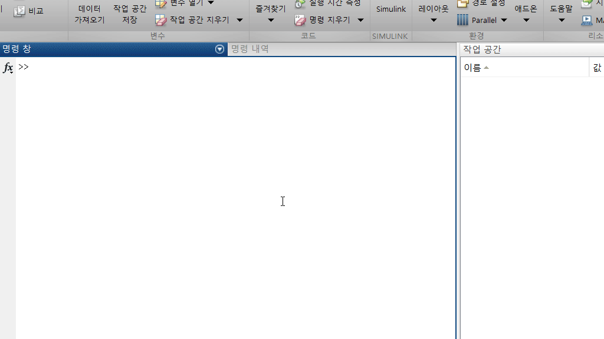

# I2M_DataGen
- This is to generate a KIMSONGLII2M training files

> main.m  [SubScript] 실행 명령어\
TextMaker.m  [SubScript] 폰트별 교육 데이터 생성\
TrainIMG.m  [SubScript] 교육 데이터로 훈련 진행\
FolderRGB2Gray.m  [SubScript] 디렉토리의 RGB 이미지를 회색조로 전환\
FolderRenameChr.m  [SubScript] 디렉토리의 파일 삭제\
ReadIMG.m  [Function] 이미지 파일 정리하고 라벨링\
FigPopup.m  [Class] 비교·재훈련을 위한 팝업창 관리\
tableObj.m  [Class] 데이터 관리 및 확인 용도의 table\
test.mat  [Data] TrainIMG.m에서 저장한 훈련 데이터

**사용법**\
적당한 테스트 이미지 파일을 만들어 저장한 후,\
main을 통해서 실행
```
main
```

